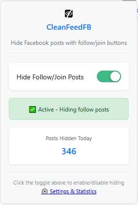
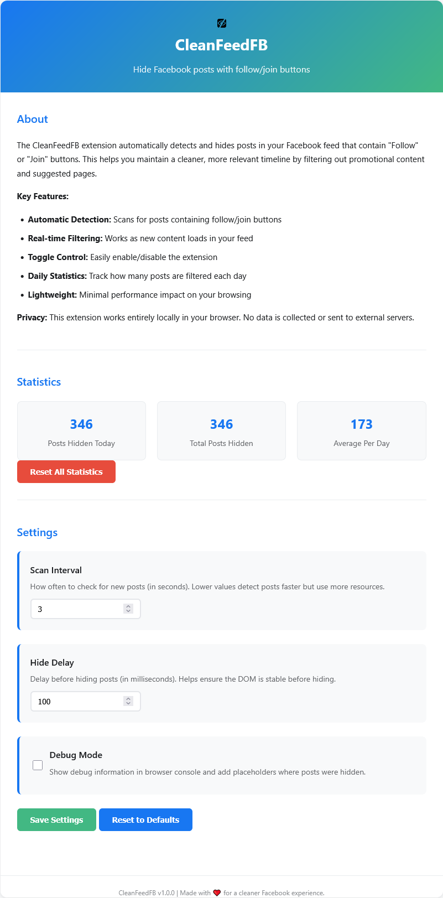

# CleanFeedFB

**CleanFeedFB** is an open source lightweight browser extension that removes *irrelevant suggestions* (like "Join Group" or "Follow Page" posts) from your Facebook feed, so you can focus on updates from **your friends** and **pages you actually follow**.

## Features
- Hides posts suggesting groups to **Join** and pages to **Follow**
- Keeps your feed clean, focused, and distraction-free
- Easy to install and open source
- Works automatically after installation

## Installation

### Mozilla Firefox
[example.com](example.com)

### Google Chrome
[Google Chrome Webstore](https://chromewebstore.google.com/detail/cleanfeedfb/eannhnggjphooldllonhjkacflpfplol)

### Microsoft Edge
[example.com](example.com)

## Usage
Once installed, the extension will immediately begin hiding suggested content in your main feed.
A new icon button will appear in the browser toolbar. If not visible, then click on the `Extensions` icon to find it in the list. You can pin it if desired. The tooltip displays CleanFeedFB. 

#### The Popup page
Click on the button, and a popup will open. Here you will be able to enable and disable the extension. The panel also displays the state of the extension (active/disabled), and a count of posts hidden today. At the bottom, you will find a link to the Options page.

#### The Options page
This page contains an `About` and `Statistics` section. Further below, there is a `Settings` section which allows you to control the following parameters:
* **Scan Interval** : How often to check for new posts (in seconds). Lower values detect posts faster but use more resources. Allows for a range between 1..30 seconds. Default 1s.

* **Hide Delay** : Delay before hiding posts (in milliseconds). Helps ensure the DOM is stable before hiding. Allows for a range between 0..1000 milliseconds, in increments of 50. Default 100ms.

* **Debug Mode** : Show debug information in browser console and add placeholders where posts were hidden. Allows to enable/disable debug mode for troubleshooting. Default unchecked.

--- 

## Why this tool
Facebook increasingly shows algorithmically suggested content. 
While some might find it useful, many prefer a less cluttered, more authentic experience. 
CleanFeedFB helps you reclaim your timeline.

## Permissions & Privacy
CleanFeedFB only modifies your view of Facebook's web interface. 
It does **not** track, store, or send any of your data anywhere.

## Contributing
Pull requests are welcome! Feel free to fork the repo and submit your improvements.

## License
MIT License. See [LICENSE](http://www.opensource.org/licenses/MIT) for details.

## Other credits
Coded with help from [claude.ai](https://claude.ai/) and [Gemini](https://gemini.google.com/). Icons from [uxwing.com](https://uxwing.com/hiding-apps-icon/).

## Links
- [GitHub Repository](https://github.com/salvoventura/CleanFeedFB/)
- [CleanFeedFB on the Firefox Browser Add-ons ](#)
- [CleanFeedFB on the Chrome Web Store](#)

